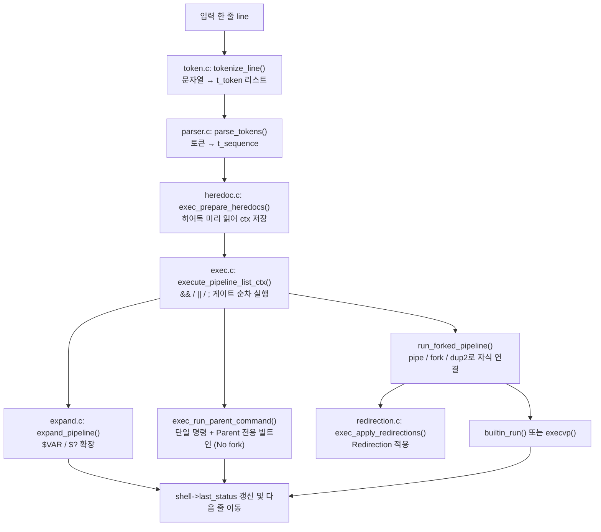

# REPORT

## 간단한 소개

`small-shell`은 POSIX 셸의 핵심 파이프라인(토큰화 -> 파싱 -> 확장 -> 실행)을 C로 직접 구현한 미니 셸이다. 파이프(`|`), 리다이렉션(`<`/`>`/`>>`), 히어독(`<<`), 논리 연결자(`&&`/`||`/`;`), 변수 확장(`$VAR`, `$?`), 따옴표 처리, 빌트인(`cd`/`export`/`unset`/`exit` 등)을 지원한다.  

모든 시스템 콜은 `runtime.c`의 래퍼를 거치게 해, 테스트에서 특정 호출만 골라 실패시키는 장애 주입(fault injection)이 가능하도록 만든 것이 이 프로젝트의 구조적 특징이다.

## 요청/데이터 흐름

이 흐름은 `execute_pipeline_list_ctx()`에서 세 갈래로 갈라졌다가(fan-out) 전부 다시
`shell->last_status` 갱신 한 지점으로 합류하는(fan-in) DAG다 — 트리형 표기로는 이
합류가 표현이 안 돼 정보가 누락되므로, 엣지를 그대로 나열하는 Mermaid로 그린다.

## 메인 소스

1. **`include/shell.h`** — 토큰/명령/파이프라인/시퀀스/환경변수 자료구조를 포함한다.
   `t_executor_hooks`(함수 포인터 기반 실행 훅)는 실행 로직을 테스트에서 주입 가능하게 만든 구조다.
2. **`src/runtime.c`** — 모든 syscall을 `shell_*` 래퍼로 감싸(`[INTV:ARCH]`) 테스트가 특정 호출만 골라 실패시키는 장애 주입을 가능하게 한다. `SMALL_SHELL_TESTING` 매크로 덕분에 프로덕션 빌드에서는 이 오버헤드가 전혀 남지 않는다.
3. **`src/token.c`** — `LITERAL_MARK`(`[INTV:ARCH]`)로 작은따옴표/큰따옴표를 서로 다르게 인코딩해, 확장 여부 판단을 다음 단계(expand)로 넘기는 것이 핵심 설계다.
4. **`src/parser.c`** — `parse_tokens()`(`[INTV:ARCH] [FLOW]`)는 단일 패스 상태 전이로 sequence/pipeline/command 3단 구조를 동시에 조립한다. `add_redir()`는 "마지막 리다이렉션이 이긴다" 순서를 보장한다.
5. **`src/expand.c`** — `expand_word()`는 `$` 체크보다 LITERAL_MARK 체크를 먼저 한다 (`[INTV:TRAP]`). 히어독 타깃만 `dequote_word()`로 별도 처리한다.
6. **`src/heredoc.c`** — 가장 밀도 높은 파일이다. 히어독은 fork 이전에 부모가 전부 미리 읽어(`[INTV:ARCH][TRAP]`) 여러 자식이 stdin을 두고 경쟁하는 상황을 막고, 실패 시에도 구분자까지 입력을 계속 읽어 버린다(`discard_heredoc()`).
7. **`src/exec.c`** — `run_child()`는 pipe dup2 이후에 리다이렉션을 적용해(`[INTV:ARCH]`) 파일 리다이렉션이 파이프를 덮어쓰게 한다. `close_pipes()`는 두 지점에서 호출되어 EOF가 전파되지 않는 행을 막고(`[INTV:TRAP]`), `process_error_status()`의 258 센티널은 `main.c`의 `normalize_status()`와 짝을 이룬다(`[INTV:EDGE]`).
8. **`src/redirection.c`** — 히어독은 파이프가 아니라 `tmpfile()`에 써서(`[INTV:ARCH]`) 파이프 버퍼 한계로 인한 교착을 피한다. `exec_run_parent_command()`는 stdin/stdout을 백업-복원해(`[INTV:ARCH][TRAP]`) 부모 프로세스 자신의 fd를 되돌린다.
9. **`src/builtin.c`**, **`src/env.c`** — `cd`는 `OLDPWD`/`PWD`를 직접 갱신하고, `export FOO`(값 없는 export)와 `export FOO=bar`는 `env_set()`의 NULL value로 구분한다.
10. **`src/main.c`**, **`src/input.c`** — 세션 시작 시 `env_from_environ()`의 NULL은 빈 환경과 진짜 실패를 구분해 판별하고(`[INTV:TRAP]`), 프롬프트는 stderr로 쓰며, 두 fd 모두 tty여야 interactive로 본다.

## 부가 소스

- `tests/` 아래 셸 스크립트(`smoke.sh`, `faults.sh` 등)와 `parser_api.c`/`timeout_runner.c`는
  테스트 하네스다. `runtime.c`의 `SMALL_SHELL_TESTING` 장애주입 환경변수(`SMALL_SHELL_FAIL_ALLOC` 등)를 이 스크립트들이 어떻게 쓰는지 확인할 수 있다.